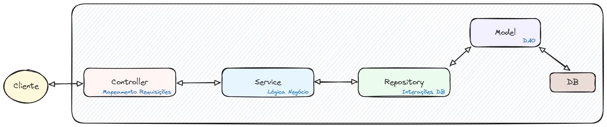
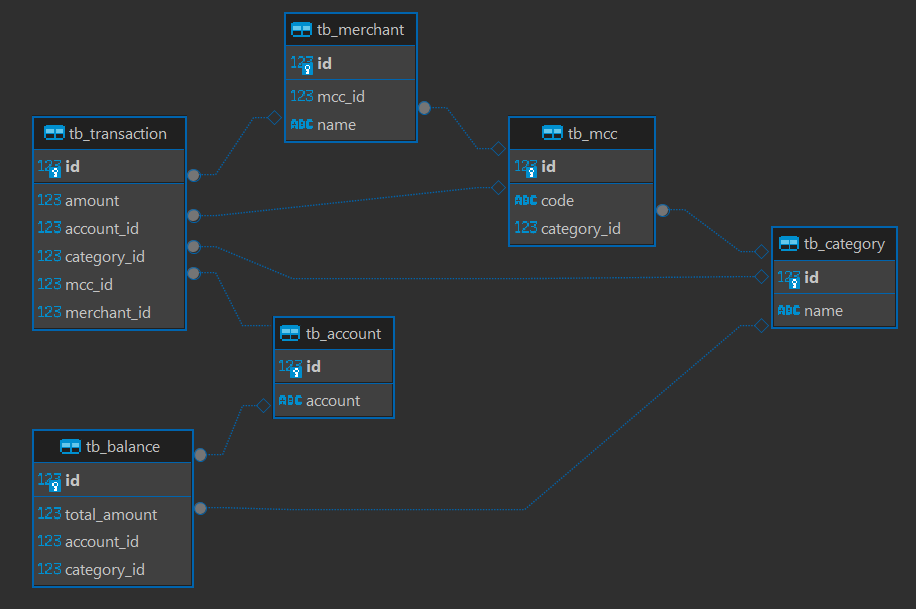

# Transaction Authorizer

Este projeto tem como objetivo simular a autorização de transações com cartão de crédito.

## Descrição

**Payload:**
```json
{
    "account": "000078956984567",
    "amount": 20,
    "merchant": "PADARIA DO ZE               SAO PAULO BR",
    "mcc": "5411"    
}
```
- **account:** identificador para a conta;
- **amount:** o valor a ser debitado de um saldo;
- **merchant:** o nome do estabelecimento.
- **mcc:** o `MCC` é um código numérico de 4 digitos que classifica os estabeleciomentos comerciais de acordo com o tipo de produto vendido ou serviço prestado;
  - Se o `MCC` for `5411` ou `5412` deve-se utilizar o saldo de `FOOD`;
  - Se o `MCC` for `5811` ou `5812` deve-se utilizar o saldo de `MEAL`;
  - Para quaisquer outros valores do `MCC`, deve-se utilizar o saldo de `CASH`;

Caso a transação seja aprovada, o saldo da categoria mapeada é diminuída de `totalAmount`.

Se o `MCC` não pode ser mapeado para uma categoria de benefícios ou se o saldo da categoria fornecida não for suficiente para pagar a transação inteira, verifica-se o saldo de `CASH` e, se for sulficiente, debita esse saldo.

Quando os `MCCs` estão incorretos a transação deve ser processada levando em consideração os dados do comerciantes. O nome do comerciante tem maior precedência sobre as `MCCs`.

**Respostas:**

Se a transação for **aprovada**:
```json
{
  "code": "00",
  "message": "Transação realizada com sucesso."
}
```
Se a transação for **rejeitada**, porque possui saldo insuficiente:
```json
{
  "code": "51",
  "message": "Transação rejeitada, saldo insuficiente."
}
```
Qualquer problema que ocorra e impeça a transação de ser processada:
```json
{
  "code": "07",
  "message": "Transação não pode ser processada."
}
```

## Diagramas
A seguir temos um diagrama da estutura do projeto, seguindo o padrão MVC (Model-View-Controller):



- **Controller:** A camada do controlador mapeia as solicitações dos usuários para funções específicas, encaminhando a entrada recebida para a camada de serviço, onde a lógica de negócios será aplicada.
- **Service:** Esta camada intermediária entre a controller e a repository executa a lógica de negócios e validação. A controller encaminha a entrada do usuário para a camada de serviço, que, após aplicar a lógica de negócios necessária, encaminha os dados para a camada repository.
- **Repository:** A camada de repositório é responsável por interagir diretamente com o banco de dados, realizando operações por meio das classes DAO.
- **Model:** Contém as classes DAO, que executam as operações de banco de dados e mapeiam os dados para objetos.

### Diagrama de ER

O diagrama de entidade e relacionamento (ER) ilustra a estrutura do banco de dados, onde cada transação é registrada na tabela `tb_transaction`. A tabela `tb_balance` mantém o saldo total por categoria e conta. As tabelas `tb_account`, `tb_category`, `tb_mcc` e `tb_merchant` armazenam detalhes das contas, categorias, códigos MCC e comerciantes, respectivamente, com chaves estrangeiras interligando essas tabelas para garantir a integridade referencial e facilitar a manutenção dos dados financeiros.



Descrição das Tabelas e Relacionamentos:

`tb_transaction`
  - **id:** Identificador único da transação.
  - **amount:** Valor da transação.
  - **account_id:** Chave estrangeira que referencia a conta (**tb_account**).
  - **category_id:** Chave estrangeira que referencia a categoria (**tb_category**).
  - **mcc_id:** Chave estrangeira que referencia o código MCC (**tb_mcc**).
  - **merchant_id:** Chave estrangeira que referencia o comerciante (**tb_merchant**).


`tb_balance`
  - **id:** Identificador único do saldo.
  - **total_amount:** Valor total do saldo.
  - **account_id:** Chave estrangeira que referencia a conta (**tb_account**).
  - **category_id:** Chave estrangeira que referencia a categoria (**tb_category**).


`tb_account`
  - **id:** Identificador único da conta.
  - **account:** Número da conta.


`tb_category`
  - **id:** Identificador único da categoria. 
  - **name:** Nome da categoria.


`tb_merchant`
  - **id:** Identificador único do comerciante;
  - **mcc_id:** Chave estrangeira que referencia o código MCC (**tb_mcc**);
  - **name:** Nome do comerciante.


`tb_mcc`
  - **id:** Identificador único do código MCC.
  - **code:** Código do MCC.
  - **category_id:** Chave estrangeira que referencia a categoria (**tb_category**).

## Requerimentos
- Java 22
- Maven

## Recursos Utilizados
- Spring Boot
- PostgreSQL
- Junit (Mockito)

## Rodando Projeto

1. Garanta que você tenha o JDK do [Java 22](https://jdk.java.net/22/) instalado;
2. Garanta que você possui o [Maven](https://maven.apache.org/download.cgi) instalado;
3. Certifique-se de ter o [Docker](https://docs.docker.com/desktop/) instalado na sua máquina. Você pode encontrar instruções detalhadas de instalação aqui.
4. Navegue até a pasta `docker` no projeto e execute o seguinte comando no terminal: `docker compose up`. Isso iniciará um container com o banco de dados Postgres configurado e em execução.
5. Finalmente, selecione a classe principal `TransactionAuthorizerApplication` no seu ambiente de desenvolvimento e execute a aplicação. As tabelas devem ser criadas no banco de dados e os dados iniciais inseridos conforme detalhado no arquivo `import.sql`.

## Rodando Testes Unitários
Para rodar os testes unitários basta executar o seguinte comando:
```bash
mvn test
```
